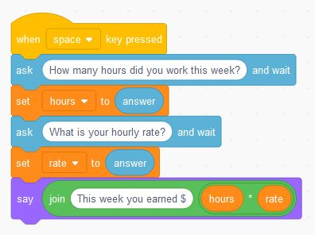

# Calculating Pay

Doing a single operation calculation.

[Video (YouTube)](https://youtu.be/nVhhQRKqVsI)

Previous Activity: [Getting Started with Scratch](https://github.com/teachintech90/math.code/blob/main/Scratch/000-Getting-Started/README.md)

Next Activity: [Order of Operations - Calculating Mileage](https://github.com/teachintech90/math.code/blob/main/Scratch/002-Order-Of-Operations/README.md)

Final Code:

## Additional activities
Your teacher will assign you some of the items below or you can choose to work through some of them on your own.

1. Calculate the total number of tools shipped to the store.  You will ask for the number of tools shipped in from the east warehouse and how many tools are shipped from the west warehouse.  Display the total number of tools shipped.

1. Calculate the total number of doors stored in the warehouse.  Ask for the number of doors at the start of the day then ask for the number of doors shipped out of the warehouse during the day.  Display the number of doors remaining in the warehouse.

1. Calculate the area of a square.  You will need to ask for the length of the side of the square. Then calculate and display the area.

1. Calculate the number of boxes needed to package up an order.  Ask for the number of products in the shipment and the number of products per box.  Display the number of boxes needed to package the order.

1. Calculate the total cost of a truck.  Ask for the purchase price of the truck and the combined amount of money for taxes, registration, and fees.  Display the total cost of the truck.

1. Calculate the number of people per room.  You will need to ask the total number of people that are attending the event then the number of rooms available for that event.  Display the number of people that will stay in each room.

1. Calculate the amount of money spent.  Ask for the starting amount of money and the amount of money remaining after purchasing some items.  Display the total amount of money spent.

1. Calculate the amount of tax for a purchase.  You will need to ask for the amount of the purchase and also the tax rate.  The calculate and display the amount of tax.

1. Calculate the number of quarts in a gallon.  Ask for the number of quarts then display the corresponding number of gallons.

1. Find the supplementary angle.  Ask for the degrees in one angle then calculate and display the supplementary angle.

1. Calculate the area of a rectangle.  You will need to ask for both the length and the width of the rectangle.  Then calculate and display the area.

1. Caclulate the miles traveled.  Ask for the odometer reading before starting the trip then ask for the odometer reading at the end of the trip.  Display the total miles traveled.

1. Calculate the number of stocks that can be purchased.  Ask for the amount of money to spend on stocks and the cost for each share of stock.  Display the number of shares of stock that can be purchased.

1. Calculate the number of parts made each minute.  Ask for the number of parts made in one hour then display the number of parts created each minute.

1. Caclulate the miles traveled in two days.  Ask for the miles traveled on day one then the miles traveled on day two.  Display the miles traveled in those two days.

1. Calculate the valentine's day gift cost.  Ask for the amount spent on flowers and the amount spent on candy.  Display the total amount spent.

1. Calculate the number of ounces needed for two receipes.  Ask for how many ounces of chocolate chips are needed for the first receipe and how many are needed for the second receipe.  Display the total ounces needed for both receipes.

1. Find the temperature change.  Ask for the temperature on one day then ask for the temperature on another day.  Display the temperature change.

1. Convert inches to centimeters.  Ask for the number of inches to convert to centimeters.  Multiply inches by 2.540 to get the number of centimeters then display that value.

1. Calculate the total taco cost.  Ask for the number of tacos and the cost of each taco.  Display the total cost of the tacos.

1. Additional problems as assigned by your teacher or that you would like to try on your own.
