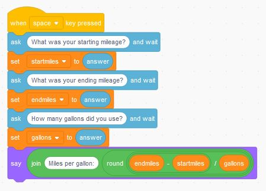

# Order of Operations - Calculating Mileage

Doing a multiple operation calculation, video covers order of operation.

[Video (YouTube):](https://youtu.be/osZqYKOklIQ){:target="_blank"}

Final Code:

## Additional activities

The following may be assigned by your teacher or you can choose to work through on your own.

1. 
