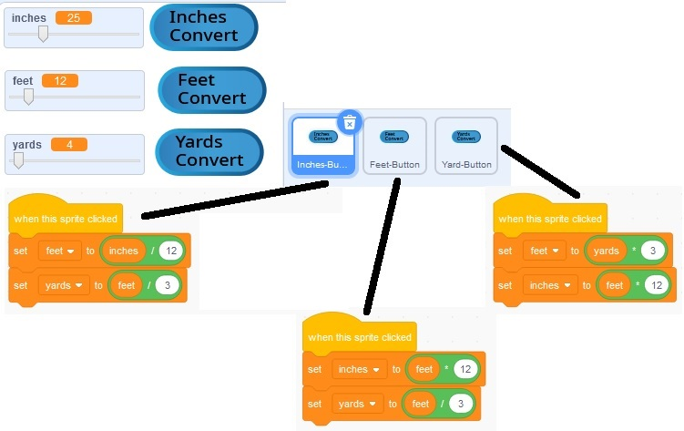

# Converting Between Units

Code to convert between inches, feet, and yards.

[Video (YouTube)](https://youtu.be/stB1_cookDs)

Previous Activity: [Order of Operations - Calculating Mileage](https://github.com/teachintech90/math.code/blob/main/Scratch/002-Order-Of-Operations/README.md)

Next Activity: [Conditions - Overtime Pay](https://github.com/teachintech90/math.code/blob/main/Scratch/004-Conditions-Overtime-Pay/README.md)

Final code:

## Activities

Your teacher will assign you some of the items below or you can choose to work through some of them on your own. If not sure how to do the problem or the terms used, first research and try then ask you teacher if needed.

1. Convert between ...
