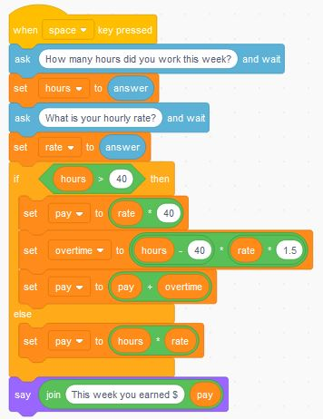

# Conditions (Logic) - Overtime Pay

Calculations that involve checking conditions (logic).  Example is overtime pay.

[Video (YouTube)](https://youtu.be/wbGtm4LyAh8)

Previous Activity: [Converting Between Units](https://github.com/teachintech90/math.code/blob/main/Scratch/003-Converting-Between-Units/README.md)

Next Activity: [Repetitive Calculations](https://github.com/teachintech90/math.code/blob/main/Scratch/005-Calc-Repeat/README.md)

Final Code:

## Additional activities

The following may be assigned by your teacher or you can choose to work through on your own.

1. Additional problems as assigned by your teacher or that you would like to try on your own.  Ask your teacher's permission for your idea if this is part of a class.
