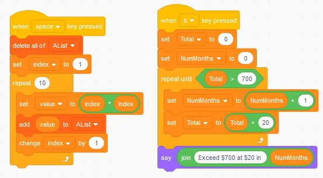

# Repetitive Calculations

Doing repetitive calculations including a list of calculations and finding the best deal.

[Video (YouTube)](https://youtu.be/3ierxxPpWUU)

Previous Activity: [Conditions - Overtime Pay](https://github.com/teachintech90/math.code/blob/main/Scratch/004-Conditions-Overtime-Pay/README.md)

Next Activity: [Animation - Simple](https://github.com/teachintech90/math.code/blob/main/Scratch/010-Animation-Simple/README.md)

Final Code:

## Additional activities

The following may be assigned by your teacher or you can choose to work through on your own.

1. A
