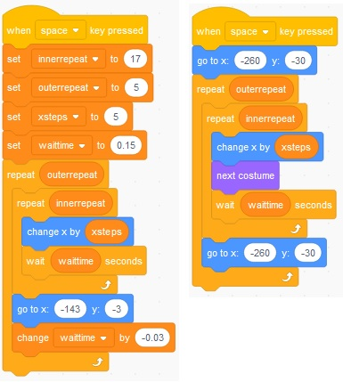

# Animation with Two Sprites

Animation with two sprites, example is a car with a smoke trail.

[Video (YouTube)](https://youtu.be/hZYvOmTATw8)

Previous Activity: [More Simple Animation - Scale and Rotate](https://github.com/teachintech90/math.code/blob/main/Scratch/011-More-Simple-Animation/README.md)

Next Activity: 

Final Code:

## Additional activities

The following may be assigned by your teacher or you can choose to work through on your own.

1. Animate three birds flying in a pattern. The lead bird will be in front of and above the other two.  The next bird will be below and behind the first bird.  The final bird will be below and behind the second bird.  The birds will start at the bottom left portion of the screen and work to the upper right portion.

1. Additional problems as assigned by your teacher or that you would like to try on your own. Ask your teacher's permission for your idea if this is part of a class.
